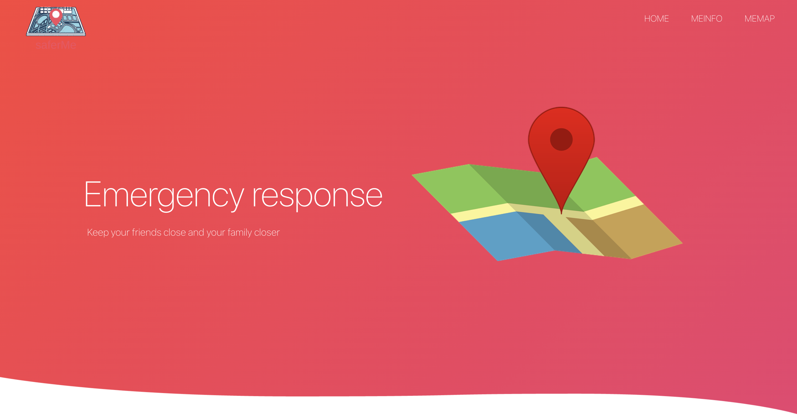
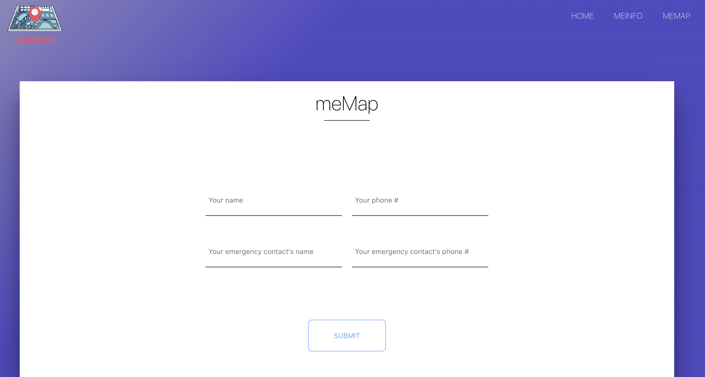
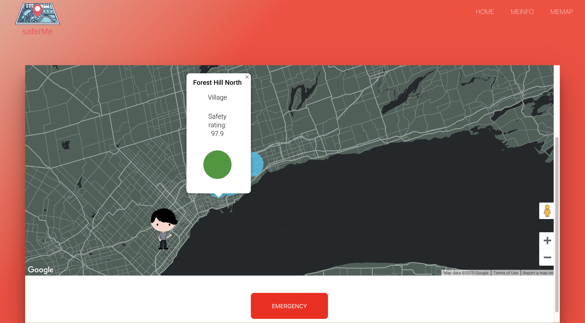

# saferMe

#### saferMe protects you from surrounding threats and provides immediate emergency communication. saferMe is ideal for something like a solo night out on an unkown trail. 

#### This is done through marking safety zones across Canada. Each safety zone is acquainted with a safety rating that has been formulated using past historical data as well as current crime rates.

> #### Home page



> #### User info entry



> #### User map



## Run app

```
npm run start
```

- Version: 1.0
